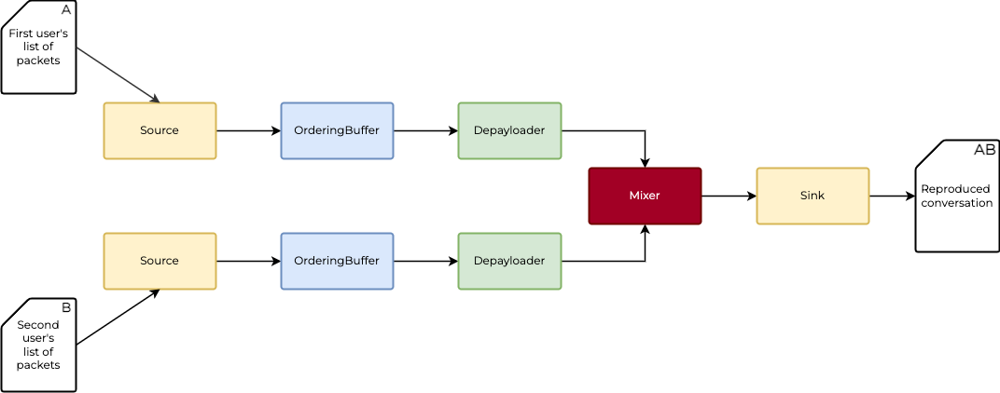

# Bin

A Membrane's bin is a container for [elements](../glossary/glossary.md#element), which allows for creating reusable groups of elements.
Bin is similar to a [pipeline](../glossary/glossary.md#pipeline) in that it consists of linked elements. Such bin can then be placed inside a pipeline and linked with other entities - elements or bins. Bins can also be nested within one another.
Bin also has another advantage - it manages its children, for instance by dynamically spawning or replacing them as the stream changes.

## Enclosing pipeline elements inside a bin

As you can see, we have [`Source`](../glossary/glossary.md#source) -> [`Ordering Buffer`](../glossary/glossary.md#jitter-buffer--ordering-buffer) -> [`Depayloader`](../glossary/glossary.md#payloader-and-depayloader) chain, which is duplicated.
 <br>

We can encapsulate these elements inside `Bin`.
 <br>

Notice that there is no direct connection between `Depayloader` and [`Mixer`](../glossary/glossary.md#mixer). We have to explicitly link the `Depayloader` with `Bin`'s output [pads](../glossary/glossary.md#pad) and then we will connect the output pads to `Mixer`'s input pads.

Let's define the bin's output pads and its elements.

**_`lib/Bin.ex`_**

```Elixir
defmodule Basic.Bin do
  use Membrane.Bin

  def_output_pad :output,
    demand_unit: :buffers,
    caps: {Basic.Formats.Frame, encoding: :utf8}

  @impl true
  def handle_init(_opts) do
    children = %{
      input: %Basic.Elements.Source{location: "input.A.txt"},
      ordering_buffer: Basic.Elements.OrderingBuffer,
      depayloader: %Basic.Elements.Depayloader{packets_per_frame: 4}
    }

    links = [
      link(:input) |> to(:ordering_buffer) |> to(:depayloader) |> to_bin_output(:output)
    ]

    spec = %ParentSpec{children: children, links: links}

    { {:ok, spec: spec}, %{} }
  end
end
```

The output pads of the bin are matching the one we [defined for depayloader](/basic_pipeline/08_Depayloader.md#libelementsdepayloaderex-2).
Notice that the last link is between `depayloader` and the bin's output pads. In general, if we wanted to receive data in a bin we would have to define input pads and the first link would be `link_bin_input()` which would link the input pads with the first element in the bin.

Although the bin is already functional, to make it reusable we have to parametrize it with the input filename. That's why we will define options for the bin, which we will use in the `source` element.

**_`lib/Bin.ex`_**

```Elixir
defmodule Basic.Bin do
  use Membrane.Bin

  ...


  def_options input_filename: [
                type: :string,
                description: "Input file for conversation."
              ]

  @impl true
  def handle_init(options) do
    children = %{
      input: %Basic.Elements.Source{location: options.input_filename},
      ...
    }
    ...
  end
end
```

## Modifying pipeline using bin

Using the bin we created, we can replace the elements in the pipeline.

**_`lib/Pipeline.ex`_**


```Elixir
defmodule Basic.Pipeline do
  @moduledoc """
  A module providing the pipeline, which aggregates and links the elements.
  """
  use Membrane.Pipeline

  @impl true
  def handle_init(_opts) do
    children = %{
      bin1: %Basic.Bin{input_filename: "input.A.txt"},
      bin2: %Basic.Bin{input_filename: "input.B.txt"},
      mixer: Basic.Elements.Mixer,
      output: %Basic.Elements.Sink{location: "output.txt"}
    }

    links = [
      link(:bin1) |> via_in(:first_input) |> to(:mixer),
      link(:bin2) |> via_in(:second_input) |> to(:mixer),
      link(:mixer) |> to(:output)
    ]

    spec = %ParentSpec{children: children, links: links}

    { {:ok, spec: spec}, %{} }
  end
end
```

Combining the usage of the bin and [dynamic pads](/basic_pipeline_extension/02_DynamicPads) will result in an even cleaner and more scalable solution.
